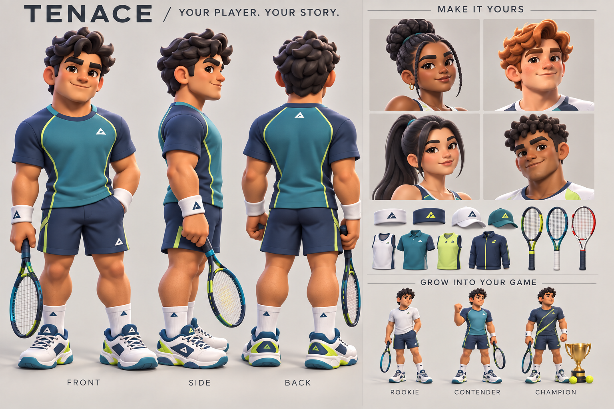

# Your player. Your story.

Status: visual concept and production brief, not a delivered 3D asset or implemented creator expansion. The current playable version remains 0.20. This brief supplements the preserved v0.2 design bible.

## Direction

The protagonist is the player's creation. The athlete in the turnaround is one example configuration, not a fixed hero or a roster selection. Aim for cohesive, expressive, sculpted cartoon characters with strong silhouettes and readable tennis movement. Clash Royale is a rendering and appeal reference; all characters and equipment should be original.

Keep a recognizable face and silhouette throughout the career. Progress should show through confidence, reactions, clothing, equipment and the places the player earns access to. Leveling never silently changes their face, skin tone, gender presentation or body shape.

The generated board is an art target, not a dimensionally exact modeling blueprint. Its miniature progression figures and some equipment details vary: the modeler must resolve those into one consistent production character. Generated symbols are placeholders, not final TenAce branding.

## Creator experience

1. **Identity:** name and optional pronouns. The story addresses the created player; no mandatory fixed protagonist name or background.
2. **Appearance:** choose a starting face, then curated face variations, skin tone, eye color, hair/color and brows. Offer masculine, feminine and androgynous presentations without tying clothing or gameplay classes to them.
3. **Build:** a small set of tested athletic body shapes on a shared skeleton. Use bounded options initially so every outfit fits; arbitrary height and limb-length sliders are outside the first asset scope.
4. **Kit:** tops, bottoms, shoes, headwear, wristwear, racket and coordinated color channels. Always show the actual match model while editing. Allow orbit, front/back views and a ready/swing preview.
5. **Personality:** stance and celebration choices, followed by a short on-court introduction. Story choices should express an attitude and influence relationships rather than assign permanent moral labels.

Provide a useful default and let players start immediately. Keep edits reversible until saved, allow later appearance changes, and preserve career progress. Keep core identity options available from the start; reserve earned unlocks for additional cosmetics and expressive animations.

## Rig and asset contract

- Deliver one production-quality base mesh and shared skeleton, with compatible body variants, authored skin weights and a small facial expression set. Supply editable source files as well as a game-ready GLB export and documented usage rights.
- Treat hair, headwear, tops, bottoms, shoes, wristwear and rackets as interchangeable modules with stable IDs. Garments use compatible weights. Define body-region hiding beneath garments and cap/hair compatibility to prevent clipping.
- Keep skin, eyes, hair and clothing color channels separate. New colors must preserve shading and material character; do not simply tint a complete character texture.
- Provide racket grip and string-bed contact anchors, both hands, feet and facial controls. Rig proportions must support the existing court and contact coordinates. Initial integration must retain current right-handed play; left-handed play needs mirrored contact, serve and animation verification before it becomes a creator option.
- Required clips: ready/breathing, split step, left/right recovery, forehand and backhand preparation/contact/follow-through, serve, fist pump and disappointed reset. Supply phases or event markers so gameplay timing drives the animation without moving the ball to fit a pose.
- Use foot planting and smooth transitions. Animation must respect hold-to-load and directional swipe input, including an early buffered swing and a cancelled hold.
- Author readable shapes for a roughly 70–110-pixel on-court player as well as a creator close-up. Prioritize silhouette, face appeal and motion over tiny decorative detail.
- Establish geometry, texture, draw-call and frame-time budgets by profiling the first imported character with both players and the venue on actual target phones. A polished still or desktop frame rate is not acceptance evidence.

## Career and story

Preserve the existing loop: story → train → match → rewards → upgrade → rival/location unlock. Begin at Riverdale with Jax; retain earned access to Mira. The design bible's coach introduction and tournament journey are future story work, not already implemented scenes.

The first complete story slice should introduce the created player at Riverdale, teach a swing, stage Jax's challenge, recognize the result and award the existing earned upgrade. A loss still grants the existing XP and offers targeted training plus a rematch. The coach responds to what happened rather than assuming a win. The created name, look and kit appear consistently in dialogue portraits, the court, results and career screens.

Leveling improves Power, Control, Speed and Tennis IQ while timing, positioning and tactics remain decisive. Preserve the existing level-three Striker, Tactician and Retriever choices. Show concrete effects and tradeoffs before spending an upgrade; appearance and identity do not modify these attributes.

Rookie, Contender and Champion on the board describe long-term visual progression, not three replacement avatars or currently implemented ranks. Gear appearance is separate from any future mechanical equipment system. Do not add invisible stat bonuses to cosmetic items.

## Save compatibility

The shipped save uses `tenace.career.v1` with `character.name`, skin/hair/shirt/shorts/racket colors, hairstyle and racket frame. Preserve those fields and earned XP, stats, path and victories during migration. Add versioned IDs for face, body and modular assets with safe defaults for missing or unavailable content. Keep appearance, owned cosmetics, skill progression and story flags distinct; do not infer earned rewards from a rendered outfit.

## First production acceptance gate

Finish one base character with two face/body configurations, three hairstyles, two fitted kits and one racket before expanding the catalog. These must be combinations in the same creator, not hard-coded alternate characters.

Verify all combinations through serve, forehand, backhand and recovery without visible garment gaps, detached limbs or hand/racket separation. Confirm both court ends, clean ball contact and planted support feet. Save, reload and cancel edits without changing career rewards. Inspect the same model at phone match size, in portraits and in the creator, and profile a sustained rally on target hardware.

The next asset milestone is an authored mesh/rig matching this concept and contract. The concept image cannot itself be imported as an animated 3D character. No sculpting commission, paid asset purchase or completed asset delivery is implied by this brief.

## Image provenance

`create-your-player-v1.png` was created using the built-in image-generation tool. A first render leaned too realistic; a targeted edit increased stylization and silhouette readability. The exact generation and edit prompts are recorded in `CONCEPT_PROMPTS.md`. This image is development concept art and is not loaded by the live game.
